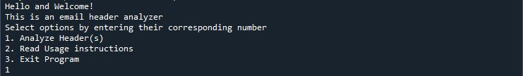

# 📧 Email Header Analyzer

**Author:** Aliyah Ibrahim  
**Version:** 2025-June-29  
**Bootcamp:** Cyber Security Bootcamp – CCUBED

---

## 🧠 Project Overview

This Email Header Analyzer is a Python-based CLI tool that analyzes raw email headers to determine the credibility of an email using three authentication mechanisms:

- **SPF** (Sender Policy Framework)
- **DKIM** (DomainKeys Identified Mail)
- **DMARC** (Domain-based Message Authentication, Reporting & Conformance)

This tool can help detect spoofing and phishing attempts by verifying these components and generating a credibility score.

---

## ✨ Features

- ✅ Supports input via text file or pasted header  
- ✅ Extracts SPF, DKIM, and DMARC results  
- ✅ Color-coded console output using `colorama`  
- ✅ Calculates credibility score (out of 100)  
- ✅ Supports multiple headers in a single session  
- ✅ Saves results in a timestamped `.txt` report file

---
### 📖 Use Cases

- Auditing suspicious emails
- Demonstrating email authentication mechanisms
- Educating users on email spoofing detection


## ⚙️ Prerequisites

- Python 3.8+
- `colorama` library

### 📦 Installation

1. Clone or download the repository  
2. Install the required package:

```bash
pip install -r requirements.txt

```
or manually install by:
```bash
pip install colorama
```
## How To Use
Run the program using:
```bash
python email_header_analyzer.py
```
Then follow the on-screen prompts:

1. Select the Analyze Header(s) option by entering in 1.

2. Select whether to paste the email header or read it from a file.

3. If reading from a file, provide the filename (with or without path).

4. If you have multiple headers, separate them using the keyword #NEXT#.
    
### Sample Input File
    Email header 1 info---
    #NEXT#
    Email header 2 info---

### Sample OutPut
1. Sample console output  
   

2. Sample file output  
   

## Author
**Aliyah Ibrahim O.**

Computer Science Enthusiast & Mechanical Engineering Student

## 📬 Contact

For questions, feel free to connect with me via email at aliyahib07@gmail.com


Note: This README was created with guidance and assistance from AI tools(ChatGPT)
